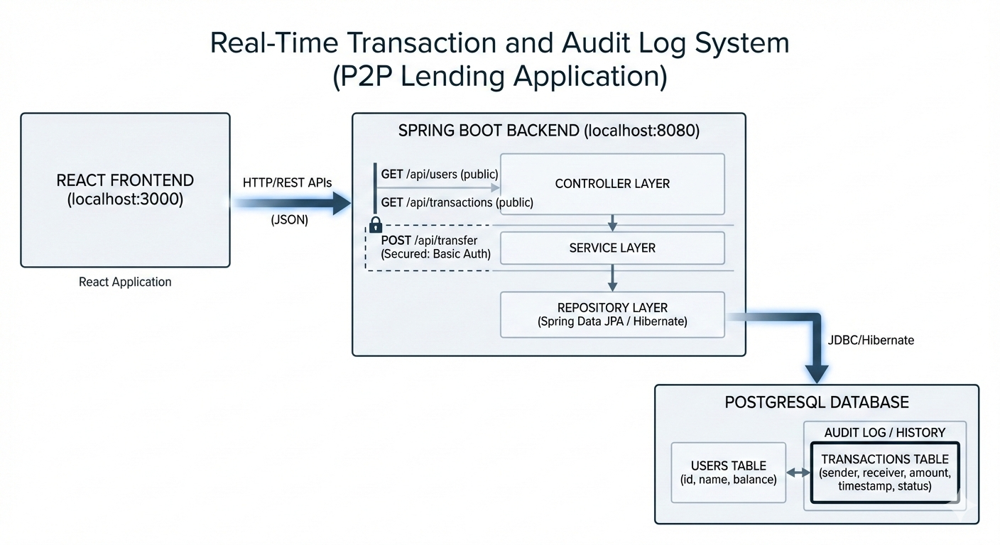
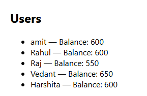
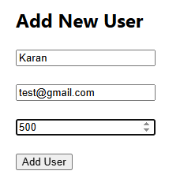
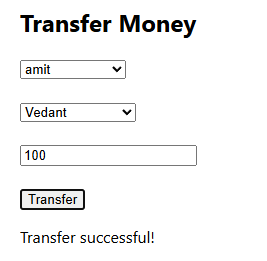
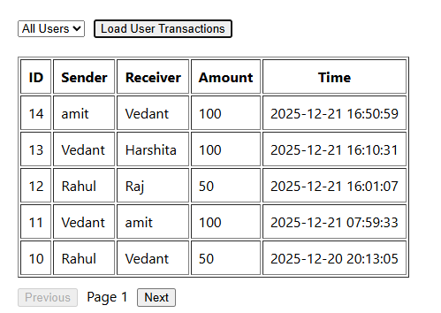
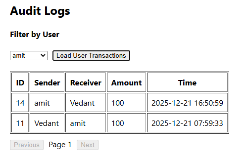

# Real Time Transaction and Audit Log System

## Project Overview

This project implements a Real-Time Transaction and Audit Log System for a peer-to-peer (P2P) lending use case. It simulates secure fund transfers between users while maintaining a persistent audit trail of all transactions.

The primary objective of this assignment is to demonstrate:
- Real-time transaction processing with strong database consistency
- Accurate audit logging of all financial transactions
- Secure API design for sensitive operations
- Clear separation of concerns across controller, service, and persistence layers
- End-to-end integration between backend services and a frontend application

The system allows users to:
- View all registered users along with their current balances
- Perform authenticated fund transfers between users
- View a complete transaction history that serves as an audit log

## Tech Stack

### Backend
- Java 17
- Spring Boot
- Spring Data JPA (Hibernate)
- Spring Security with JWT Authentication
- PostgreSQL

### Frontend
- React (JavaScript)
- Fetch API for HTTP communication

### Tools & Utilities
- Git & GitHub for version control
- Postman for API testing
- IntelliJ IDEA for backend development
- pgAdmin for database inspection

## System Architecture



The above diagram represents the high-level architecture of the Real-Time Transaction and Audit Log System.

- The React frontend communicates with the Spring Boot backend via REST APIs.
- The backend follows a layered architecture (Controller, Service, Repository).
- Transaction creation APIs are secured using JWT Authentication.
- All transactions are persistently stored in PostgreSQL and act as an immutable audit log.

### NOTE - Screenshots of the application can be found in the [Screenshots](#screenshots) section below.

## Features Implemented

- User creation and retrieval via REST APIs
- Balance management per user
- Secure fund transfer between users
- Atomic transaction handling using @Transactional
- Persistent audit logging with sender, receiver, amount, status, and timestamp
- User-specific transaction history (sender or receiver)
- Global transaction history across all users
- Pagination support for transaction logs
- DTO-based response mapping for API safety
- Real-time UI refresh after successful operations
- Centralized exception handling and validation


## Security Design

JWT-based authentication has been implemented using Spring Security.

### Authentication Flow
- Users can register using the Signup API
- Registered users can log in using email and password
- On successful login, the backend generates a JWT token
- The frontend stores the token in localStorage
- All protected API requests include the token using the Authorization header

### Protected Endpoints
The following endpoints require JWT authentication:
- `POST /api/transfer`
- `GET /api/transactions`
- `GET /api/transactions/all`

### Security Features
- Stateless authentication using JWT
- Password-protected user accounts
- Token-based authorization for protected operations
- Session-independent API access
- Unauthorized requests return appropriate HTTP status codes

This approach closely resembles modern fintech and banking backend authentication flows.


## API Documentation

### User APIs
- `GET /api/users`  
  Retrieves the list of all users and their balances

### Transaction APIs
- `POST /api/transfer`  
  Transfers funds from one user to another  
  **Query Params**: senderId, receiverId, amount  
  **Authentication**: Required (Basic Auth)

- `GET /api/users/{userId}/transactions`  
  Retrieves transactions where the user is either sender or receiver

- `GET /api/transactions/all`  
  Retrieves all transactions across all users (paginated)

### Authentication APIs

- `POST /auth/signup`
  Registers a new user account

- `POST /auth/login`
  Authenticates a user and returns a JWT token

## Database Schema

### Users Table
- id (Primary Key)
- name
- balance

### Transactions Table
- id (Primary Key)
- sender_id (Foreign Key → Users)
- receiver_id (Foreign Key → Users)
- amount
- status
- timestamp

## Setup and Run Instructions

This section provides step-by-step instructions to set up and run both the backend and frontend components of the application on a local machine.

---

## Prerequisites

Ensure the following software is installed on your system:

- Java JDK 17
- PostgreSQL (with pgAdmin)
- Node.js (v18 or above) and npm
- Git

---

## Backend Setup (Spring Boot)

### 1. Clone the Repository

```
git clone https://github.com/Vedxnt299/Real-Time-Transaction-and-Audit-Log-System-.git
cd transactionservice
```

### 2. Create PostgreSQL Database
Open pgAdmin and create a new database with the name:
p2p_db

### 3. Configure Database Connection

Update the `application.properties` file with the following values:

```properties
spring.datasource.url=jdbc:postgresql://localhost:5432/p2p_db
spring.datasource.username=postgres
spring.datasource.password=your_password
spring.jpa.hibernate.ddl-auto=validate
spring.jpa.show-sql=true
```
### 4. Start the Backend Server

Run the Spring Boot application using:

```
./mvnw spring-boot:run
```


---

## **Backend Security (JWT Authentication)**

```
The money transfer API is secured using HTTP Basic Authentication.
- Secured Endpoint:
- Demo Credentials:
    Username: user
    Password: user123

> Note: Security is intentionally kept simple for demonstration purposes and can be extended to JWT or OAuth-based authentication.
```
## Frontend Setup (React)

### 1. Navigate to the Frontend Directory

`cd p2p-frontend`

### 2. Install Dependencies 
`npm install`

### 3. Start React Application 
`npm start`

---

## **Application Access Summary**

```
| Component              | URL / Name            |
|------------------------|-----------------------|
| React Frontend         | http://localhost:3000 |
| Spring Boot Backend    | http://localhost:8080 |
| PostgreSQL Database    | p2p_db                |
```

## AI Tool Usage Log 

### AI-Assisted Development Overview

AI tools were used during the development of this project to improve productivity, reduce boilerplate effort, and assist with debugging and documentation. All core business logic, design decisions, and final implementations were reviewed and validated manually.

### AI-Assisted Tasks

- Assistance in structuring the Spring Boot project using a layered architecture
- Generation of boilerplate code for controllers, services, and repositories
- Debugging support for Spring Security configuration and CORS-related issues
- Suggestions for improving error handling and validation logic
- Assistance in drafting and structuring the project README documentation
- Support in designing the system architecture diagram

### AI Tools Used

- **ChatGPT** – for backend development guidance, debugging assistance, and documentation support
- **Gemini** – for generating the system architecture diagram

### Effectiveness Score

**Score: 4 / 5**

AI tools significantly accelerated development by reducing setup time and assisting with configuration and documentation. However, core logic, testing, and final integration were performed manually to ensure correctness and reliability.

## Major Enhancements Added

### JWT Authentication System

A dedicated feature branch `jwt-auth-enhancement` was created to implement production-style authentication without affecting the stable release branch.

### Features Added
- JWT-based authentication using Spring Security
- User Signup and Login APIs
- Stateless authentication architecture
- Token validation using custom JWT filters
- Secure access to protected APIs using Bearer tokens
- React frontend integration with login and signup UI
- Token persistence using localStorage
- Automatic authorization header attachment for API requests
- Logout functionality with token cleanup

### Engineering Practices Followed
- Feature implemented in an isolated Git branch
- Stable `main` branch preserved during development
- Incremental enhancement workflow similar to real-world software teams


## Screenshots

The following screenshots demonstrate the core functionality and user experience of the Real-Time Transaction and Audit Log System.

### User List and Balances
Displays all registered users along with their current account balances.



---

### Add New User
UI form to create a new user with name, email, and initial balance.



---

### Fund Transfer
Secure money transfer between users with real-time balance updates.



---

### Audit Logs – All Users
Complete transaction audit log showing transfers across all users.



---

### Audit Logs – User Specific
Filtered transaction history for a selected user.



